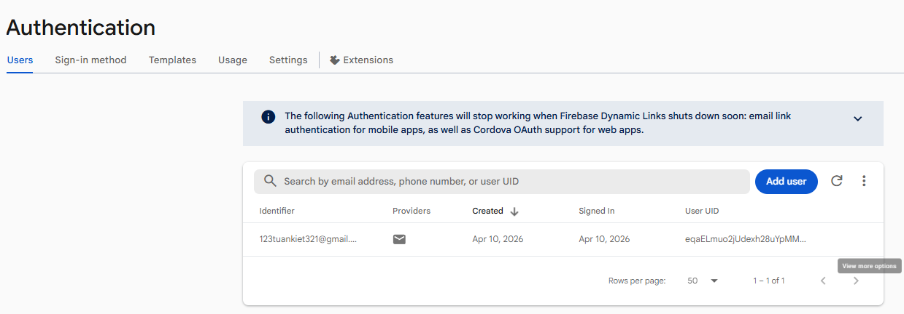
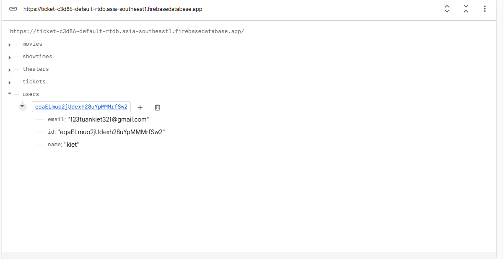
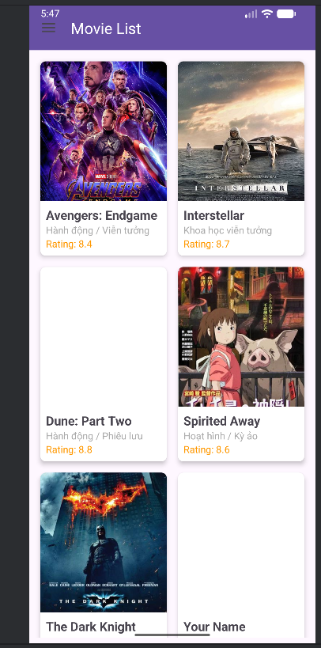
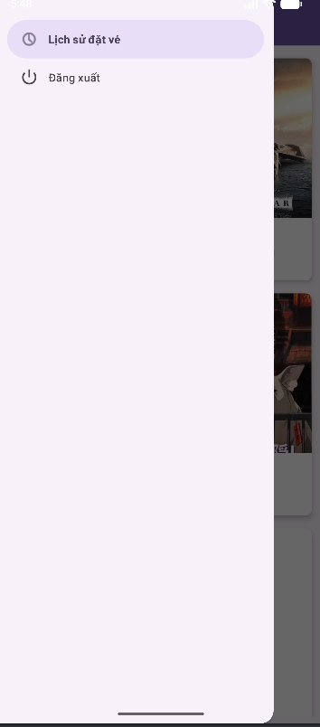
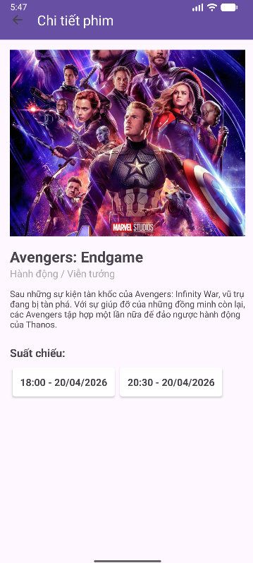
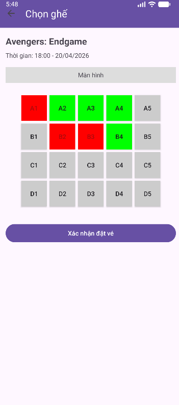
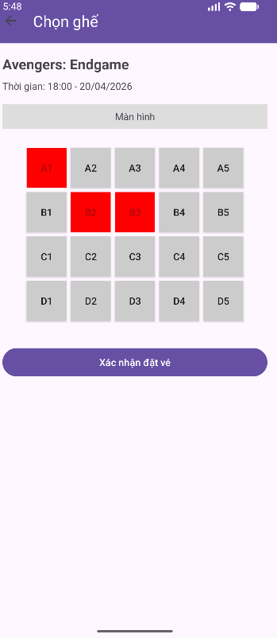
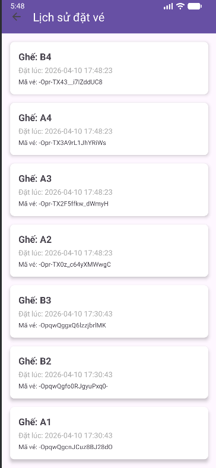
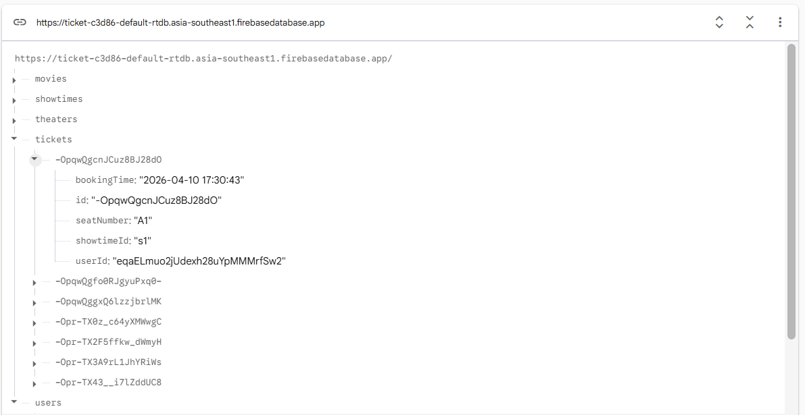

# Movie Ticket App - Firebase Integration

Ứng dụng đặt vé xem phim sử dụng Android Studio và Firebase (Authentication & Realtime Database).

## Các Tính năng Chính
- **Xác thực người dùng**: Đăng ký và Đăng nhập với Firebase Auth.
- **Danh sách phim**: Hiển thị danh sách phim từ Realtime Database với hình ảnh (Glide).
- **Chi tiết phim & Suất chiếu**: Xem thông tin chi tiết và chọn các khung giờ chiếu khác nhau.
- **Đặt vé (Chọn nhiều ghế)**: 
    - Chọn nhiều ghế cùng lúc (A1, B2, ...).
    - Ghế đã đặt sẽ hiển thị màu đỏ và bị vô hiệu hóa.
    - Ghế đang chọn hiển thị màu xanh.
- **Quản lý tài khoản**: Drawer Layout tích hợp Đăng xuất và Lịch sử đặt vé.
- **Lịch sử đặt vé**: Xem danh sách các vé đã đặt, sắp xếp vé mới nhất lên đầu.
- **Thông báo**: Tích hợp Firebase Cloud Messaging (FCM).

## Hình ảnh Giao diện

### 1. Đăng nhập & Đăng ký

### 2. Danh sách phim & Menu điều hướng

### 3. Chi tiết phim & Chọn suất chiếu

### 4. Chọn ghế & Đặt vé

### 5. Lịch sử đặt vé & Firebase Database

## Cấu trúc Firebase
- `users/`: Lưu thông tin cá nhân.
- `movies/`: Danh sách phim và thông tin poster.
- `showtimes/`: Các suất chiếu cho từng bộ phim.
- `tickets/`: Danh sách vé đã được đặt thành công.

## Cài đặt
1. Clone dự án.
2. Thêm file `google-services.json` vào thư mục `app/`.
3. Cấu hình Realtime Database và Authentication (Email/Password) trên Firebase Console.
4. Import dữ liệu mẫu từ file JSON (nếu có).
